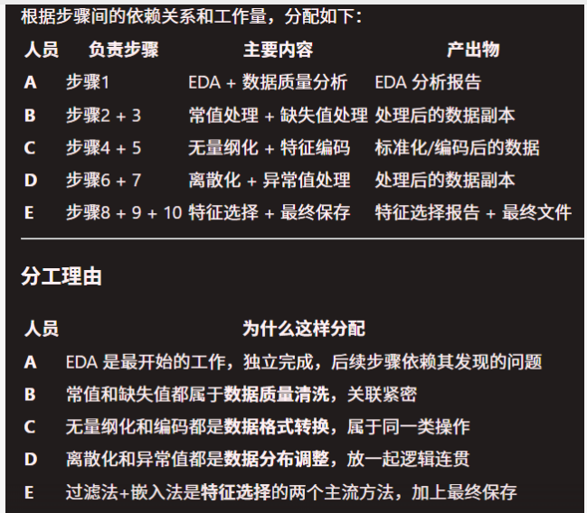

# 1 针对原始数据进行分析

## 1.1 原始数据文件类型

一共三个文件，均是excel文件，分别为14年1月数据，18年1月数据和数据字段说明

# 2 原始数据分析

原始数据集共 108 列、35,219 行。本阶段的核心任务是进行特征列筛选，旨在保留能反映理赔行为特征的有效数据，剔除对风控模型（识别异常/欺诈理赔）判断无贡献的干扰列。

经过分析，依据以下 6 条规则，共删除 61 列，保留 47 列用于后续模型训练：

* **规则一：数据质量过滤**
  * 删除空值率达到 100% 以及 >85% 的列，缺失过多填充会引入偏差，影响模型可信度。
  * 删除唯一值数量为 1 的列，所有行取值相同，对模型无任何区分度。
* **规则二：剔除与业务目标无关字段**
  * 删除系统操作日志（如 `CRT_USER`、`UPD_DATE` 等），这些属于后台管理信息，不反映理赔内容。
  * 删除公式描述文本（如 `CL_CLAIM_FORMULA` 等），其数值结果已体现在对应的金额列中。
* **规则三：隐私合规（PII 脱敏）**
  * 删除直接识别个人身份的字段（如身份证号、手机号、银行账号、姓名），以符合数据最小化合规要求，防止隐私泄露，并避免模型对特定个人过拟合。
* **规则四：剔除纯标识符与流水号**
  * 删除每行唯一的 ID、条形码、发票编号、文件编号等（如 `CLLI_OID`、`BARCODE`、`INVOICE_ID`），模型无法从单一序列号中学到规律，直接使用会导致过拟合。
* **规则五：信息冗余处理（保留编码，删除文本）**
  * 同一信息同时存在编码列和文本描述列时，保留编码/数值型列，删除文本型/冗余列（例如保留 `DIAG_CODE`，删除 `DIAG_DESC`；保留 float 类型的金额，删除 object 类型的金额）。
* **规则六：剔除高空值低价值文本**
  * 删除空值率较高且内容为非结构化自由文本的列（如 `LINE_REMARK`、`PLAN_REMARK` 等），直接使用对模型帮助有限。

**总结：** 最终保留的 47 列涵盖了风控模型所需的核心特征维度，包括理赔金额、付款结构、诊断信息、医院信息、理赔状态、被保险人属性、保单信息以及时间特征等。

## 2.1 按照工作量划分到5个人

  

* A 何
* B 管
* C 尧
* D 李
* E 张

# 3 执行步骤规划

## 3.1 将两个excel文件合并为一个excel文件

14年和18年两年数据从整体来说并没有绝对明显的差异特征，因此合并为同一个excel文件，应该不影响后续的模型训练，并且合并后，方便读取、插值等操作