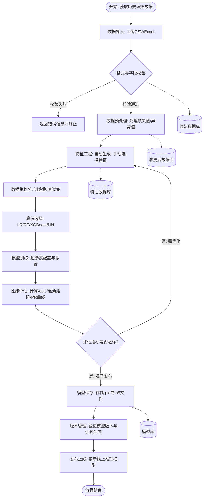
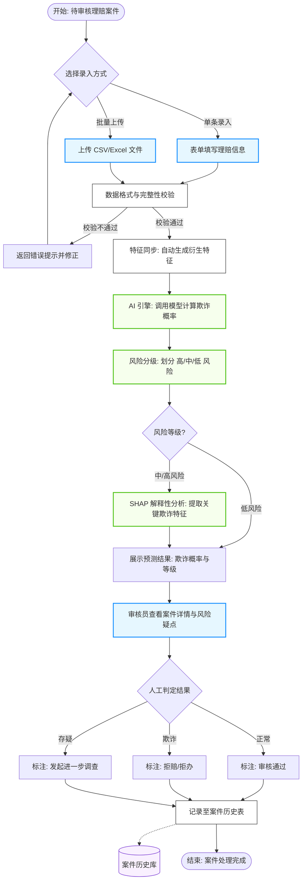
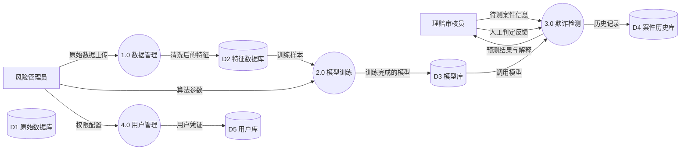
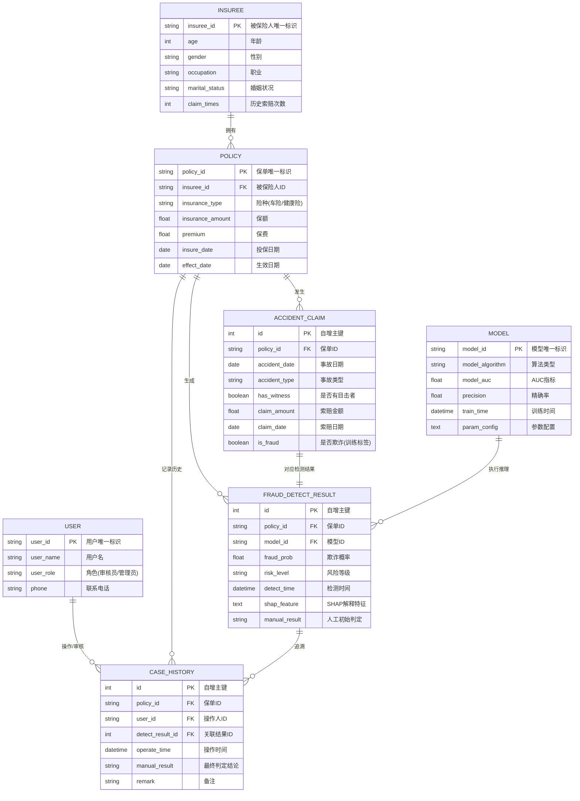

# 保险理赔风控需求分析

## 1. 引言

### 1.1 文档目的

本文档旨在明确保险理赔风控系统的 用户需求、功能需求、业务流程及数据规范，为系统的设计、开发、测试及验收提供统一的需求依据，确保项目各参与方对系统需求达成共识。

### 1.2 项目背景

随着保险业数字化发展，保险理赔欺诈问题愈发突出，传统人工审核 + 规则引擎的反欺诈手段存在效率低、识别能力弱等痛点。 本项目基于人工智能与大数据技术，构建保险理赔风控系统，实现欺诈行为的自动检测与风险预警。

### 1.3 系统范围

本系统聚焦医疗保险理赔欺诈检测场景，核心覆盖数据管理、模型训练、欺诈检测、系统集成四大核心模块，配套基础的用户管理功能，不涉及保险公司核心业务系统的深度对接，仅通过文件上传、API 接口实现数据交互与预测服务。

---

## 2. 用户需求

本系统的核心用户分为理赔审核员和模型开发者两类，不同用户的角色定位、使用场景及核心需求存在显著差异，具体需求如下表所示：

| 用户类型 | 角色定位 | 核心使用场景 | 功能需求 | 体验需求 |
| :--- | :--- | :--- | :--- | :--- |
| **理赔审核员** | 一线理赔案件处理人员，无人工智能基础知识 | 1. 单条理赔案件的风险查询 2. 批量理赔案件的风险筛查 3. 高风险案件的疑点查看与人工判定 4. 欺诈检测结果的记录与追溯 | 1. 支持快速录入 / 上传理赔案件信息 2. 直观展示案件欺诈风险等级、概率 3. 可查看影响风险判定的关键特征 4. 支持对案件标注人工判定结果（通过 / 拒绝 / 进一步调查） 5. 可查询历史案件的检测与处理记录 | 1. 界面操作简洁，无复杂专业操作 2. 单条查询响应速度快，批量查询有进度提示 3. 风险结果展示清晰，疑点突出标注 4. 支持常用操作的快捷入口 |
| **模型开发者** | 系统与模型的维护人员，具备算法 / 开发知识 | 1. 模型的训练、调优与重训 2. 模型效果的监控与评估 3. 理赔数据的上传、预处理与特征工程 4. 系统检测指标的统计与报表生成 5. 基础的用户权限管理（可选） | 1. 支持多算法选型与超参数调节 2. 可查看模型训练的评估指标（混淆矩阵、AUC 等） 3. 支持数据清洗、特征生成的自定义配置 4. 可生成欺诈检测日报 / 月报等统计报表 5. 支持模型的保存、加载与版本管理 6. 可配置用户角色与操作权限（可选） | 1. 提供灵活的参数配置界面 / 脚本 2. 支持模型训练过程的日志查看 3. 评估指标与报表支持可视化展示 4. 代码 / 配置可追溯，支持版本回滚 |

---

## 3. 功能需求

本系统的功能需求按 数据管理模块、模型训练模块、欺诈检测模块、系统集成模块、用户管理模块 五大核心模块划分，每个模块包含具体功能点、功能描述、输入输出及约束条件，具体如下：

### 3.1 数据管理模块

核心实现理赔数据的全生命周期处理，从数据导入到特征工程，为模型训练和欺诈检测提供高质量数据支撑。

| 功能点 | 功能描述 | 输入 | 输出 | 约束条件 |
| :--- | :--- | :--- | :--- | :--- |
| **数据导入** | 支持上传 CSV/Excel 格式的理赔数据，自动进行文件格式、字段完整性校验，校验不通过则返回错误提示 | CSV/Excel 格式的理赔数据文件 | 1. 校验通过：数据导入成功提示，数据进入待处理队列 2. 校验失败：明确的错误信息（如字段缺失、格式错误、文件损坏） | 1. 仅支持 CSV/Excel 格式，单文件大小不超过 100MB 2. 上传文件需包含系统预设的核心字段（如保单号、索赔金额、是否欺诈标签） |
| **数据预处理** | 自动处理数据中的缺失值、异常值，支持标准化 / 归一化操作，预处理规则可配置（如缺失值填充方式、异常值过滤阈值） | 待处理的原始理赔数据，可选的预处理配置参数 | 1. 预处理后的干净数据集 2. 数据预处理报告（含缺失值 / 异常值处理数量、处理方式） | 1. 缺失率超过 30% 的字段，系统自动提示是否删除 / 填充 2. 异常值处理需符合业务逻辑（如索赔金额不允许为负） |
| **特征工程** | 自动生成欺诈检测相关的常用特征（如索赔金额与保额比值、历史索赔次数、事故与投保时间间隔），同时提供手动特征选择 / 删除接口，支持特征重要性排序 | 预处理后的干净数据集，可选的特征配置 | 1. 完成特征构造的特征数据集 2. 特征工程报告（含生成的特征列表、特征重要性排序） | 1. 生成的特征维度不少于 15 个 2. 支持特征的批量选择 / 删除，可保存特征配置方案 |

### 3.2 欺诈检测模块

核心实现理赔案件的欺诈风险检测，支持单条 / 批量预测，提供可解释的预测结果，辅助人工决策。

| 功能点 | 功能描述 | 输入 | 输出 | 约束条件 |
| :--- | :--- | :--- | :--- | :--- |
| **单条预测** | 通过表单录入单条理赔案件信息，系统调用最优模型进行检测，返回欺诈概率与风险等级 | 单条理赔案件的各项信息（与数据字段一致） | 1. 案件欺诈概率（0-1） 2. 风险等级（低 / 中 / 高，按概率阈值划分，阈值可配置） 3. 预测结果生成时间 | 单条预测响应时间不超过 3 秒 |
| **批量预测** | 上传 CSV/Excel 格式的批量理赔案件文件，系统异步进行检测，支持查询检测进度，完成后返回带预测结果的表格 | CSV/Excel 格式的批量案件文件 | 1. 检测任务 ID，实时进度提示 2. 带欺诈概率、风险等级的批量预测结果表格（可下载） | 1. 批量文件单批记录数不超过 1 万条 2. 异步任务保留 7 天，支持结果多次下载 |
| **解释性输出** | 可选输出影响预测结果的关键特征（基于 SHAP 值），按特征重要性排序，标注特征取值与影响方向 | 预测完成的案件信息 | 关键特征解释报告（含特征名称、特征取值、SHAP 值、影响方向） | 仅对高 / 中风险案件提供完整的解释性输出 |

### 3.3 系统集成模块

核心实现系统的对外服务与前端交互，提供标准化 API 接口和可视化 Web 界面，支持端到端的理赔风控流程。

| 功能点 | 功能描述 | 输入 | 输出 | 约束条件 |
| :--- | :--- | :--- | :--- | :--- |
| **RESTful API 服务** | 提供标准化的 API 接口，支持单条预测、批量预测、模型信息查询等功能，接收 JSON 格式请求，返回结构化 JSON 响应 | 1. POST /api/predict：单条案件 JSON 数据 2. POST /api/batch_predict：批量案件文件（含任务 ID） 3. GET /api/model/info：无（或模型 ID） | 1. 单条预测：欺诈概率、风险等级 JSON 结果 2. 批量预测：任务 ID、处理进度 JSON 结果 3. 模型信息：模型版本、训练时间、AUC 等 JSON 信息 | 1. API 接口返回状态码符合 HTTP 规范 2. 批量预测接口需实现幂等性，避免重复处理 |
| **Web 界面开发** | 开发可视化前端 Web 页面，包含案件录入、单条 / 批量预测、结果展示、历史查询、模型监控等功能模块，适配电脑端访问 | 用户的界面操作（点击、录入、上传、查询） | 1. 交互式操作界面，实时反馈操作结果 2. 可视化图表（风险分布、模型评估指标、统计报表） 3. 可下载的结果文件、报表文件 | 1. 界面兼容主流浏览器（Chrome/Firefox/Edge） 2. 提供操作指南弹窗 / 页面，适配非专业用户 |

### 3.4 用户管理模块（可选）

实现基础的用户认证与权限控制，区分理赔审核员和风控管理员的操作权限，保障系统数据安全。

| 功能点 | 功能描述 | 输入 | 输出 | 约束条件 |
| :--- | :--- | :--- | :--- | :--- |
| **用户登录 / 注册** | 支持用户账号注册、密码登录，提供密码找回功能，登录时进行身份验证与角色识别 | 1. 注册：用户名、密码、手机号 / 邮箱、角色选择 2. 登录：用户名、密码 3. 找回密码：手机号 / 邮箱 | 1. 注册 / 登录 / 找回密码的结果提示 2. 登录成功后跳转到对应角色的首页 | 1. 用户名唯一，密码需满足复杂度要求（字母 + 数字） 2. 支持短信 / 邮箱验证码验证 |
| **权限控制** | 为不同角色配置不同的系统操作权限，风控管理员拥有全权限，理赔审核员仅拥有欺诈检测、案件查询等基础权限 | 角色选择、权限配置操作 | 1. 权限配置成功提示 2. 用户操作时的权限校验结果（允许 / 拒绝） | 1. 基于角色的访问控制（RBAC），不支持自定义角色 2. 权限配置仅风控管理员可操作 |

---

## 4. 业务流程分析

### 4.1 核心业务流程图

本系统的核心业务流程分为 模型训练流程 和 理赔欺诈检测流程 两大主线，模型训练流程为欺诈检测流程提供可用模型，欺诈检测流程是系统的核心业务落地流程，具体流程图如下：

#### 4.1.1 模型训练业务流程图

#### 4.1.2 理赔欺诈检测业务流程图

### 4.2 数据流图（DFD）

本系统采用 分层数据流图 ，从顶层（0 层）到一层，逐步细化系统的数据流走向，明确数据的来源、处理过程、存储与输出。

#### 4.2.1 零层数据流图（系统整体概览）

* **外部实体**：理赔审核员、风控管理员、外部业务系统（可选）
* **系统边界**：保险理赔风控系统
* **核心数据处理过程**：数据管理、模型训练、欺诈检测、系统管理
* **数据存储**：原始数据库、清洗后数据库、特征数据库、模型库、案件历史库、用户信息库
* **数据流走向**：
  * 外部实体向系统输入 原始理赔数据、模型配置参数、理赔案件信息、用户操作指令 ；
  * 系统通过核心处理过程对数据进行加工，将中间数据存入各类数据库 / 模型库；
  * 系统向外部实体输出 预处理报告、模型评估报告、欺诈检测结果、统计报表、操作反馈 。

#### 4.2.2 一层数据流图（核心模块细化）

以 欺诈检测模块 为例，细化数据流：

* **外部实体**：理赔审核员
* **数据处理过程**：案件信息接收、数据校验、模型调用、预测结果生成、解释性输出、结果展示与存储
* **数据存储**：模型库、案件历史库
* **数据流**：

### 4.3 数据字典

数据字典是系统的核心数据规范，定义了系统中所有核心数据项、数据表的名称、类型、长度、含义、约束条件等，为数据采集、处理、存储和开发提供统一标准，本系统核心数据字典分为 核心数据项 和 核心数据表 两部分。

#### 4.3.1 核心数据项

| 数据项名称 | 数据类型 | 长度 | 单位 / 取值范围 | 含义说明 | 约束条件 |
| :--- | :--- | :--- | :--- | :--- | :--- |
| policy_id | 字符串 | 32 | 无 | 保单唯一标识 | 非空，唯一 |
| insurance_type | 字符串 | 16 | 车险 / 意外健康险 | 险种类型 | 非空，仅支持指定取值 |
| insurance_amount | 浮点数 | 16,2 | 元 | 保额 | 大于 0 |
| premium | 浮点数 | 16,2 | 元 | 保费 | 大于 0 |
| insure_date | 日期 | 无 | YYYY-MM-DD | 投保日期 | 非空，早于事故日期 / 索赔日期 |
| effect_date | 日期 | 无 | YYYY-MM-DD | 保单生效日期 | 非空 |
| insuree_id | 字符串 | 32 | 无 | 被保险人唯一标识 | 非空 |
| age | 整数 | 3 | 18-100 | 被保险人年龄 | 非空，符合取值范围 |
| gender | 字符串 | 2 | 男 / 女 / 未知 | 被保险人性别 | 非空，仅支持指定取值 |
| occupation | 字符串 | 32 | 无 | 被保险人职业 | 非空 |
| marital_status | 字符串 | 8 | 未婚 / 已婚 / 离异 / 丧偶 | 被保险人婚姻状况 | 非空，仅支持指定取值 |
| claim_times | 整数 | 3 | 0-∞ | 历史索赔次数 | 非空，大于等于 0 |
| accident_date | 日期 | 无 | YYYY-MM-DD | 事故日期 | 非空 |
| accident_type | 字符串 | 32 | 无 | 事故类型（如车辆碰撞 / 意外摔伤） | 非空 |
| has_witness | 布尔值 | 1 | 0（无）/1（有） | 是否有事故目击者 | 非空，仅支持 0/1 |
| claim_amount | 浮点数 | 16,2 | 元 | 索赔金额 | 大于 0 |
| claim_date | 日期 | 无 | YYYY-MM-DD | 索赔日期 | 非空，晚于事故日期 |
| is_paid | 布尔值 | 1 | 0（未赔付）/1（已赔付） | 是否已赔付 | 非空，仅支持 0/1 |
| paid_amount | 浮点数 | 16,2 | 元 | 赔付金额 | 大于等于 0，小于等于索赔金额 |
| is_fraud | 布尔值 | 1 | 0（正常）/1（欺诈） | 是否欺诈标签（训练数据用） | 非空，仅支持 0/1 |
| fraud_prob | 浮点数 | 6,4 | 0-1 | 欺诈概率 | 大于等于 0，小于等于 1 |
| risk_level | 字符串 | 4 | 低 / 中 / 高 | 风险等级 | 非空，仅支持指定取值 |
| user_id | 字符串 | 32 | 无 | 用户唯一标识 | 非空，唯一 |
| user_name | 字符串 | 16 | 无 | 用户名 | 非空，唯一 |
| user_pwd | 字符串 | 64 | 无 | 用户密码（加密存储） | 非空 |
| user_role | 字符串 | 16 | 理赔审核员 / 风控管理员 | 用户角色 | 非空，仅支持指定取值 |
| model_id | 字符串 | 32 | 无 | 模型唯一标识 | 非空，唯一 |
| model_algorithm | 字符串 | 32 | 逻辑回归 / 随机森林 / XGBoost / 神经网络 | 模型算法类型 | 非空，仅支持指定取值 |
| model_auc | 浮点数 | 6,4 | 0-1 | 模型 AUC 值 | 大于等于 0，小于等于 1 |
| train_time | datetime | 无 | YYYY-MM-DD HH:MM:SS | 模型训练时间 | 非空 |

#### 4.3.2 核心数据表

##### （1）保单信息表（policy_info）

* **表用途**：存储保单的基础信息
* **主键**：policy_id
* **关联键**：insuree_id（关联被保险人信息表）
* **包含数据项**：policy_id, insurance_type, insurance_amount, premium, insure_date, effect_date, insuree_id

##### （2）被保险人信息表（insuree_info）

* **表用途**：存储被保险人的个人基础信息
* **主键**：insuree_id
* **包含数据项**：insuree_id, age, gender, occupation, marital_status, claim_times

##### （3）事故与索赔信息表（accident_claim_info）

* **表用途**：存储事故详情与索赔相关信息
* **主键**：id（自增）
* **关联键**：policy_id（关联保单信息表）
* **包含数据项**：id, policy_id, accident_date, accident_type, has_witness, claim_amount, claim_date, is_paid, paid_amount, is_fraud

##### （4）欺诈检测结果表（fraud_detect_result）

* **表用途**：存储理赔案件的欺诈检测结果
* **主键**：id（自增）
* **关联键**：policy_id（关联保单信息表）、model_id（关联模型信息表）
* **包含数据项**：id, policy_id, model_id, fraud_prob, risk_level, detect_time, shap_feature（关键特征，字符串格式）, manual_result（人工判定结果）

##### （5）模型信息表（model_info）

* **表用途**：存储训练完成的模型基础信息与评估指标
* **主键**：model_id
* **包含数据项**：model_id, model_algorithm, model_auc, precision（精确率）, recall（召回率）, train_time, param_config（参数配置，字符串格式）

##### （6）用户信息表（user_info）

* **表用途**：存储系统用户的基础信息与权限
* **主键**：user_id
* **包含数据项**：user_id, user_name, user_pwd, user_role, phone, email, create_time

##### （7）案件历史表（case_history）

* **表用途**：存储所有理赔案件的检测与处理历史，实现追溯
* **主键**：id（自增）
* **关联键**：policy_id, user_id（操作人）
* **包含数据项**：id, policy_id, detect_result_id（关联欺诈检测结果表）, user_id, operate_time, manual_result, remark（备注）

---

## 5. 系统设计

基于前期的需求分析，本系统采用分层架构设计，确保 AI 模型的推理能力与业务逻辑高效集成。

### 5.1 概要设计

#### 5.1.1 系统架构图

系统采用Python AI 生态 运行环境，整体分为四层：

* **表现层（Frontend）**：基于 Vue开发前端界面，负责理赔案件录入、风险图表展示、模型训练参数配置。
* **业务逻辑层（Backend）**：基于Django框架，处理用户鉴权、数据预处理逻辑、任务调度（批量检测异步处理）。
* **模型推理层（AI Engine）**：集成 Scikit-learn、XGBoost 等算法库，负责特征工程、模型训练及基于 SHAP 的解释性输出 。
* **数据层（Data Tier）**：由关系型数据库（MySQL）存储结构化数据，模型库（文件系统）存储 .pkl 或 .h5 模型文件 。

#### 5.1.2 功能结构图

系统功能划分为以下五大核心模块：

1. **数据管理**：数据导入、预处理、特征工程 。
2. **模型训练**：算法选择（LR/RF/XGB/NN）、训练评估、模型保存 。
3. **欺诈检测**：单条/批量预测、风险等级划分、SHAP 解释性输出 。
4. **系统集成**：RESTful API 服务、Web 管理门户 。
5. **用户管理**：RBAC 权限控制、注册登录 。

### 5.2 数据库设计

#### 5.2.1 实体关系图（ER 图）

本系统的数据库设计旨在通过以下核心实体，打通从“业务基础数据”到“AI 智能推理”，再到“人工审核决策”的全链路闭环。

##### 1. 被保险人实体 (Insuree)

功能定位：存储投保客户的主体信息，是风险分析的原始源头。

核心属性：包含年龄、职业、性别及历史索赔次数等关键静态特征。

业务作用：通过统计被保险人的历史信用和行为模式，为模型提供基础风险画像。

关联关系：与保单呈 1:N 关系，即一个被保险人名下可拥有多份保单。

##### 2. 保单实体 (Policy)

功能定位：记录保险契约的核心条款与生效状态。

核心属性：涵盖保额、保费、险种类型及生效日期等。

业务作用：作为业务纽带，连接客户与具体的理赔事件；其中的保额与保费比例是识别高风险投保的重要参考。

关联关系：向上关联唯一被保险人；向下与事故索赔、检测结果及案件历史呈 1:N 关系。

##### 3. 事故索赔实体 (Accident_Claim)

功能定位：记录单次理赔申请的详细案情数据。

核心属性：包含事故类型、索赔金额、是否有目击者及训练标签（is_fraud）等。

业务作用：提供模型推理所需的动态特征；其真实标签是模型迭代优化的基础数据。

关联关系：与欺诈检测结果呈 1:1 关系，确保每一次理赔申请都有且仅有一个对应的风险评估报告。

##### 4. 模型实体 (Model)

功能定位：存储 AI 算法的版本信息及其在验证集上的性能指标。

核心属性：算法类型、AUC 值、精确率及训练时间配置等。

业务作用：实现风险判定的可追溯性，确保每一条预测结论都能定位到具体的算法版本。

关联关系：与欺诈检测结果呈 1:N 关系，一个已部署的模型可支撑海量案件的实时推理。

##### 5. 欺诈检测结果实体 (Fraud_Detect_Result)

功能定位：存储 AI 引擎对理赔案件生成的实时定量评估。

核心属性：欺诈概率、风险等级（低/中/高）及 SHAP 解释性特征。

业务作用：将复杂的模型输出转化为业务可读的风险信号，为审核员提供决策支撑。

关联关系：由模型执行生成，并对应唯一的保单与索赔记录。

##### 6. 用户实体 (User)

功能定位：管理系统操作者的身份、角色与权限。

核心属性：用户名、加密密码及角色定位（理赔审核员/风控管理员）。

业务作用：基于 RBAC 模型实现权限控制，区分审核权限与管理权限，保障数据安全。

关联关系：与案件历史呈 1:N 关系，记录其所有的审核操作轨迹。

##### 7. 案件历史实体 (Case_History)

功能定位：记录理赔案件的全生命周期处理日志。

核心属性：人工最终判定结论、操作时间及审核备注等。

业务作用：作为审计审计追踪的依据，同时其人工反馈结果可用于未来模型的再训练优化。

关联关系：作为枢纽实体，同步关联保单、检测结果与操作用户。

#### 5.2.2 物理表设计（部分核心表）

根据数据字典 ，定义以下核心物理表结构：

##### 1. 保单信息表 (policy_info)

| 字段名 | 类型 | 约束 | 说明 |
| :--- | :--- | :--- | :--- |
| policy_id | VARCHAR(32) | PRIMARY KEY | 保单唯一标识 |
| insuree_id | VARCHAR(32) | FOREIGN KEY | 关联被保险人 |
| insurance_type | VARCHAR(16) | NOT NULL | 险种（医疗保险） |
| insurance_amount | DECIMAL(16,2) | >0 | 保额 |

##### 2. 欺诈检测结果表 (fraud_detect_result)

| 字段名 | 类型 | 约束 | 说明 |
| :--- | :--- | :--- | :--- |
| id | INT | PRIMARY KEY, AUTO_INC | 自增主键 |
| policy_id | VARCHAR(32) | FOREIGN KEY | 关联保单 |
| model_id | VARCHAR(32) | FOREIGN KEY | 关联使用的模型 |
| fraud_prob | DECIMAL(6,4) | 0-1 | 欺诈概率 |
| risk_level | VARCHAR(4) | 低/中/高 | 风险等级 |
| shap_feature | TEXT | - | 关键特征解释 (JSON 格式) |

---

## 6. 产品设计（界面设计图描述）

针对不同用户角色，设计以下主要交互界面：

### 6.1 理赔审核员——“案件风险工作台”

核心布局：

* **顶部**：单条录入搜索框与批量上传按钮 。
* **左侧**：待审核案件列表，按风险等级颜色标注（高风险标红）。
* **右侧详情页**：
  * 风险仪表盘：直观展示欺诈概率（0%-100%）。
  * 原因分析区：展示 SHAP 特征重要性条形图，说明为何判定为高风险 。
  * 审核操作栏：一键标注“通过”、“拒绝”或“发起调查” 。

### 6.2 模型开发人员——“模型研发与监控中心”

该界面面向技术人员，侧重于参数控制、过程监控与效能评估。

* **数据统计区**：展示系统全局视图，包括每日检测案件总量、欺诈检出率走势图以及数据预处理异常日志。

算法配置：提供算法选型勾选框（LR/RF/XGBoost/NN）及超参数调节滑动条（如树深度、学习率等）。

* **训练日志**：实时滚动展示模型训练过程中的损失函数变化及日志信息。

* **评估可视化**：

  * 模型训练完成后，自动渲染 ROC 曲线、PR 曲线及混淆矩阵热力图。
  * 支持横向对比不同特征工程方案下的模型指标差异。

* **版本管理中心**：

  * 以列表形式展示所有历史训练模型及其 AUC 值。

提供“一键部署”功能，支持将表现最优的模型切换至生产环境提供 RESTful API 服务，并支持版本回滚。
